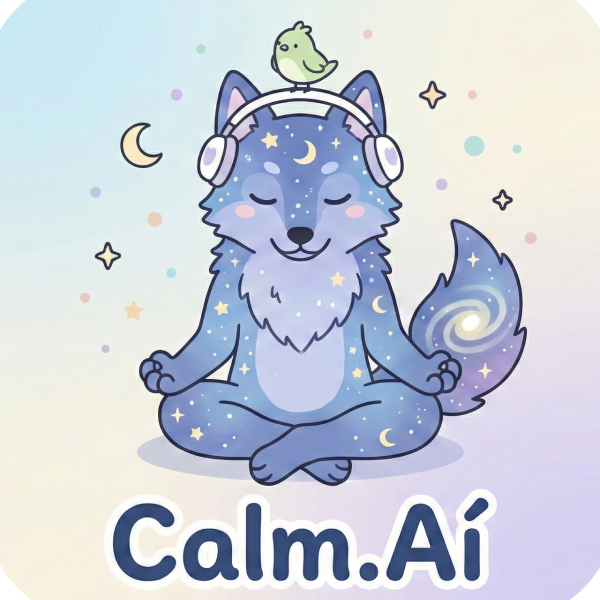

# Calm.Aí 🐾💜 - Suporte de Bolso para Mentes Inquietas



> **"Mais que um site, um abraço digital."**

---

## 💡 Sobre o Projeto

O **Calm.Aí** é uma ferramenta de regulação emocional desenvolvida durante a **Imersão Dev com Google Gemini 2025** (Alura + Google).

O objetivo é servir como uma "toca segura" para pessoas neurodivergentes (**Autismo, TDAH**) ou ansiosas. Diferente de buscas genéricas, o Calm.Aí oferece um ambiente controlado, sem distrações, onde o usuário descreve o que está sentindo e recebe imediatamente uma técnica de **TCC (Terapia Cognitivo-Comportamental)** validada para aquele sintoma.

### 🎯 O Problema Real
Em momentos de crise (meltdown, paralisia executiva ou ataque de pânico), é difícil lembrar de técnicas de respiração ou racionalização. A busca no Google muitas vezes piora a ansiedade com excesso de informações.

### 🚀 A Solução
Uma interface minimalista, acolhedora e direta, que traduz sentimentos complexos em ações simples de alívio, usando uma base de conhecimento curada por Inteligência Artificial.

---

## 🛠️ Tecnologias e Decisões Técnicas

Este projeto foi construído seguindo rigorosamente as limitações do regulamento da Imersão, focando na **base sólida da web** em vez de frameworks complexos.

| Tecnologia | Função no Projeto | Por que foi escolhida? |
| :--- | :--- | :--- |
| **HTML5 Semântico** | Estrutura e Acessibilidade | Garantir que leitores de tela e motores de busca entendam o conteúdo (uso de `<article>`, `<nav>`, `sr-only`). |
| **CSS3 (Vanilla)** | Estilização e Animações | Criar a identidade "Kawaii Cósmico" leve e performática, sem o peso de bibliotecas como Bootstrap ou Tailwind. |
| **JavaScript (ES6+)** | Lógica e Interatividade | Manipulação do DOM, busca dinâmica e controle de Modais sem dependências externas. |
| **Node.js** | Back-end (Geração de Dados) | Script (`gerador.js`) que atua como "Cozinha de Dados", conectando-se à API do Google para criar o conteúdo. |
| **Google Gemini API** | Inteligência Artificial | O "Cérebro" do projeto. Usada para gerar as psicoeducações, descrições literais e categorização dos sintomas. |

---

## 🧠 A Mágica da IA e Engenharia de Prompt

A Inteligência Artificial não apenas "escreveu código", ela atuou como **Co-autora e Psicóloga Auxiliar**. Todo o conteúdo da base de dados (`data.json`) foi gerado via **Google Gemini** através de scripts em Node.js.

### Destaques da Engenharia de Prompt:
Para garantir a qualidade e a segurança das informações, utilizei técnicas avançadas de prompt no arquivo `gerador.js`:

1.  **Persona Adotada:** A IA foi instruída a atuar como uma especialista em TCC e Neurodivergência, com tom de voz "amigo e acolhedor", evitando termos clínicos frios.
2.  **Schema Trancado:** Forçamos a IA a responder em um formato JSON rígido, garantindo que o Front-end nunca quebre.
3.  **Acessibilidade Cognitiva:** Criamos um campo específico no prompt (`explicacao_literal`) instruindo a IA a descrever sintomas de forma literal e sem metáforas, pensando especificamente no público autista que pode ter dificuldade com figuras de linguagem.
4.  **Design Generativo:** A identidade visual (Logo do Lobo Místico) também foi criada com auxílio de IA Generativa de imagem.

---

## ✨ Funcionalidades Principais

* **Busca Inteligente:** Pesquisa em tempo real que entende não só o nome do sintoma, mas também "tags ocultas" geradas pela IA (ex: se você digitar "procrastinação", ele acha "Inércia de início").
* **Modais de Acessibilidade:**
    * **Explicação Literal:** Um botão "Saber Mais" que abre uma janela com descrição direta do sintoma, sem metáforas.
    * **Educação em TCC:** Explicação didática sobre o que é a terapia para desmistificar o tratamento.
* **Link Seguro (YouTube):** O sistema gera links de busca dinâmicos para garantir que o usuário sempre encontre vídeos de ajuda atualizados, evitando links quebrados.
* **Design Sensorial:** Paleta de cores calmas (Roxo/Menta/Creme) e animações suaves (flutuação) pensadas para não sobrecarregar os sentidos (low sensory load).

---

## 🚀 Como Rodar o Projeto Localmente

Se você quiser testar a geração de dados com a IA na sua máquina:

1.  **Clone o repositório:**
    ```bash
    git clone [https://github.com/SEU-USUARIO/calm-ai.git](https://github.com/SEU-USUARIO/calm-ai.git)
    ```
2.  **Instale as dependências (apenas para o gerador):**
    ```bash
    npm install
    ```
3.  **Configure a API Key:**
    * Crie um arquivo `.env` na raiz.
    * Adicione: `GEMINI_API_KEY="SUA_CHAVE_DO_GOOGLE_AI_STUDIO"`.
4.  **Gere novos dados (Opcional):**
    ```bash
    node gerador.js
    ```
5.  **Abra o site:**
    * Basta abrir o arquivo `index.html` no seu navegador.

---

## 💜 Créditos e Agradecimentos

Este projeto é muito pessoal. Como desenvolvedora autista e TDAH, criei a ferramenta que eu gostaria de ter nos meus dias difíceis.

* **Desenvolvimento e Design:** [Cristalwolf](https://www.linkedin.com/in/cristalwolf-dias/)
* **Mentoria e Realização:** Alura + Google (Imersão Dev)
* **Apoio Técnico:** Google Gemini 2.5 Flash

---

> ⚠️ **Aviso Ético:** Este projeto tem caráter educativo e de suporte, baseado em técnicas de TCC. Ele **não substitui** terapia profissional ou aconselhamento médico. Em caso de crise, ligue 188 (CVV).
