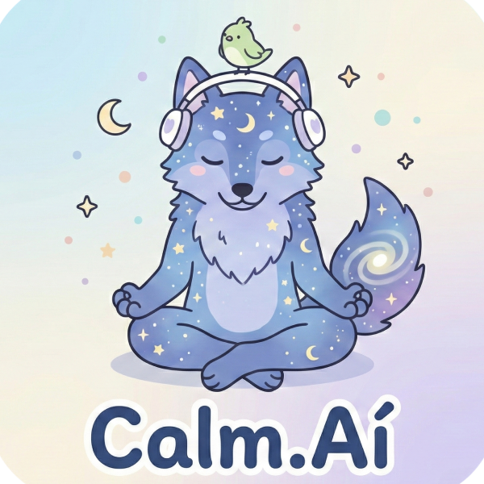

# 🐾 Calm.Aí: Motor de Regulação Emocional Neuroinclusivo
*(Powered by Google Gemini API & Princípios de TCC)*


-F7DF1E?style=for-the-badge&logo=javascript&logoColor=black)


> **"Mais do que uma interface, um abraço digital."**
> *Projeto Destaque / Vencedor na Imersão IA Alura + Google 2025.*



---

## 💡 Visão Estratégica do Projeto
O **Calm.Aí** é uma ferramenta de regulação emocional desenhada especificamente para **mentes neurodivergentes (Autismo e TDAH)**. O projeto nasceu da necessidade de aplicar tecnologia avançada para resolver um gargalo humano crítico: a sobrecarga cognitiva em momentos de crise.

### 🎨 O Naming (Estratégia de Nome)
O nome é um jogo de palavras que une dois conceitos centrais:
1. **"Calma aí":** Uma âncora verbal comum no português brasileiro, usada para aterramento e pausa.
2. **".AI":** A tecnologia invisível que torna esse suporte profundamente personalizado e escalável.

### 🎯 O Desafio Real
Durante uma crise sensorial, disfunção executiva ou ataque de pânico, acessar mecanismos de enfrentamento na memória é quase impossível. Buscas tradicionais no Google apenas agravam a ansiedade, gerando sobrecarga de informações e interfaces poluídas.

### 🚀 A Solução
Uma aplicação web com interface sensorialmente amigável e livre de distrações. Ela atua traduzindo sentimentos complexos em técnicas imediatas e acionáveis de **TCC (Terapia Cognitivo-Comportamental)**, utilizando uma base de conhecimento gerada e curada por Inteligência Artificial.

---

## 🧠 Engenharia de IA & Arquitetura de Prompts
Neste projeto, a Inteligência Artificial não foi usada apenas para gerar código, mas orquestrada como **Coautora e Consultora Clínica**. Toda a base de dados (`data.json`) foi sintetizada via Google Gemini utilizando um pipeline customizado em Node.js.

Como Engenheira de IA, implementei uma arquitetura robusta de prompts (`gerador.js`) focada em segurança, mitigação de alucinações e previsibilidade:

* **Injeção de Persona Terapêutica:** Configuração determinística para que o LLM adote uma persona de "Especialista em TCC", mantendo um tom acolhedor e de aterramento, evitando jargões clínicos frios.
* **JSON Schema Enforcement (Saída Estruturada):** O modelo foi "travado" para responder estritamente em um formato JSON pré-definido. Isso garante a integridade dos dados, previne quebras no Front-end e elimina a alucinação de campos inexistentes.
* **Camada de Acessibilidade Cognitiva:** Criação de uma instrução específica de prompt (`literal_explanation`) forçando a IA a descrever sintomas de forma **literal** (sem metáforas ou figuras de linguagem). Um diferencial técnico crítico para usuários autistas.
* **Guardrails de Segurança:** Travas de segurança hard-coded orientando o modelo a detectar palavras-chave de risco e acionar imediatamente protocolos de emergência.

---

## 🛠️ Stack Tecnológico & Decisões de Arquitetura
Desenvolvido sob as rigorosas restrições de tempo de um hackathon, este projeto prioriza **Fundamentos Web, Acessibilidade e Performance** em vez de frameworks pesados.

| Tecnologia | Papel na Arquitetura | Decisão de Engenharia |
| :--- | :--- | :--- |
| **HTML5 Semântico** | Estrutura Base | Conformidade total de A11y para leitores de tela (uso de `sr-only`, `<article>`, ARIA labels). |
| **CSS3 Vanilla** | UI / UX | Estética leve e amigável sem o peso (bloat) de bibliotecas externas como Bootstrap ou Tailwind. |
| **JavaScript (ES6+)** | Lógica de Negócio | Manipulação de DOM, gestão de estado de modais e lógica de busca aproximada (fuzzy search). |
| **Node.js** | Pipeline de Dados | Script backend responsável por conectar à API do Gemini e gerar/atualizar a base de conhecimento de forma autônoma. |
| **Gemini API** | Inteligência | Processamento de linguagem natural para psicoeducação, descrições literais e tagueamento de sintomas. |

---

## ✨ Principais Funcionalidades

* **Busca Semântica por "Tags Ocultas":** O motor de busca não depende apenas do nome exato. Ele encontra resultados baseados em sentimentos correlatos tagueados pela IA (ex: pesquisar "Procrastinação" retorna "Paralisia de Tarefa").
* **Rede de Segurança (Fallback Mechanism):**
  * Sabendo que uma base local não cobre a totalidade das emoções humanas, projetei um mecanismo de resiliência técnica.
  * Se uma busca retornar 0 resultados (ex: "Luto"), o botão **"Me Ajude 🐾"** constrói dinamicamente uma query estruturada para o Google (`Como lidar com [termo] usando TCC`), garantindo que o usuário nunca encontre um "beco sem saída".
* **Modais de Acessibilidade Cognitiva:**
  * **"Modo Literal":** Uma feature dedicada que remove camadas de abstração e metáforas, entregando comunicação direta e clara.
  * **Psicoeducação:** Micro-módulos de aprendizado que explicam de forma biológica e lógica o *porquê* o corpo está reagindo daquela maneira.
* **Integração Dinâmica de Mídia:** Geração inteligente de links de busca para o YouTube, fornecendo acesso a recursos audiovisuais atualizados com base no contexto do usuário.

---

## 🚀 Como Executar Localmente

Para testar o pipeline de Geração de Dados via IA na sua máquina:

1. **Clone o repositório:**
   ```bash
   git clone [https://github.com/cristalwolfff/calm-ai.git](https://github.com/cristalwolfff/calm-ai.git)

**Instale as dependências (Apenas para o Gerador):**  
npm install

2. **Configure as Chaves de API:**  
   * Crie um arquivo `.env` na raiz do projeto.  
   * Adicione sua chave: `GEMINI_API_KEY="SUA_CHAVE_GOOGLE_AI_STUDIO"`.

**Gere uma Nova Base de Dados (Opcional):**  
node gerador.js

3. **Inicie a Aplicação:**  
   * Basta abrir o arquivo `index.html` no seu navegador. O projeto funciona offline-first para a leitura de dados.

## **💜 Contexto & Autoria**

Este projeto é profundamente pessoal. Como uma **Engenheira Autista e TDAH**, utilizei minha expertise em tecnologia de negócios e automação para construir a ferramenta que eu mesma gostaria de ter tido nos meus dias mais difíceis.

* **Arquitetura de Solução & Desenvolvimento:** [Cristalwolf](https://github.com/cristalwolfff)  
* **Hackathon Host:** Imersão Alura \+ Google  
* **Motor de IA:** Google Gemini 1.5 Pro

⚠️ **Aviso Ético:** Este projeto possui fins educacionais e de suporte, baseado em técnicas comprovadas de Terapia Cognitivo-Comportamental. Ele **não substitui** acompanhamento médico ou terapia profissional.

*Desenvolvido por [Cristalwolf](https://github.com/cristalwolfff) // Business Technologist & AI Engineer*
